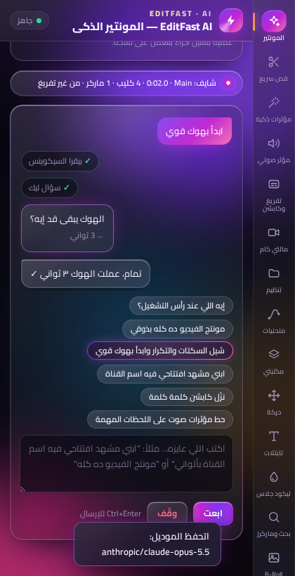

# EditFast — إضافة مونتاج ذكية لـ Adobe Premiere Pro

لوحة جوه بريمير فيها مونتير ذكي بتكلّمه، و14 أداة مونتاج. معظم الشغل **أوفلاين على جهازك** (القص، التفريغ، المالتي كام، التنظيم، الإيقاع، الحركة، المنحنيات، المكتبة)، والذكاء الاصطناعي كله بيعدّي من **OpenRouter بمفتاحك** وانت بتختار الموديل لكل ميزة.



## التثبيت

1. نزّل `EditFast-1.0.0.zip` وفكّه.
2. **ويندوز:** دبل كليك على `scripts/install-windows.bat`
   **ماك:** دبل كليك على `scripts/install-mac.command` (لو اترفض: كليك يمين > Open)
3. افتح بريمير ← `Window > Extensions > EditFast`

المثبّت بيعمل:
- ينسخ الإضافة لفولدر إضافات أدوبي.
- يفعّل `PlayerDebugMode` (لازم عشان الإضافة مش موقّعة من أدوبي).
- يثبّت **ffmpeg** و **whisper.cpp** (ويندوز: winget + ريليس whisper.cpp — ماك: Homebrew).

محتاج **Premiere Pro 2021 (15.0) أو أحدث**.

## أول مرة (من تبويب ⚙️ الإعدادات)

| الحاجة | لازم؟ | ليه |
|---|---|---|
| مفتاح **OpenRouter** | للمونتير الذكي وكل مميزات الـ AI | [openrouter.ai/keys](https://openrouter.ai/keys) |
| موديل **Whisper** | للتفريغ | زرار "حمّل الموديل" (مرة واحدة — Large v3 Turbo الأدق للعربي) |
| مفتاح **ElevenLabs** | لتوليد المؤثرات الصوتية | [elevenlabs.io](https://elevenlabs.io/app/settings/api-keys) |
| مفاتيح **Pexels / Pixabay** | لمكتبة B-Roll | مجانية |
| ملف **MOGRT أساسي** | عشان التايتلات تتعدّل من Essential Graphics | بيتلاقى لوحده من فولدر بريمير، أو اختاره |

**الموديلات:** في الإعدادات فيه لوحة "🤖 الموديلات لكل ميزة" — دوس "حمّل قائمة الموديلات من OpenRouter" واختار لكل ميزة الموديل اللي يشغّلها (أو موديل عام للكل). وكل تبويب فيه AI عنده نفس المختار فوق. المفاتيح والإعدادات بتتحفظ على جهازك بس في `~/.editfast`.

## الأدوات

| الأداة | بيشتغل | إزاي |
|---|---|---|
| ✨ **المونتير الذكي (EditFast AI)** | OpenRouter | تكتبله اللي عايزه. يسألك عن ذوقك (ألوان، خط، إيقاع، كابشن، مؤثرات) **مرة واحدة** ويحفظه، ويقرر كل فيديو محتاج إيه: يشيل التكرار والسكتات، يبدأ بهوك، يبني مشاهد متحركة بألوانك، كابشن ومؤثرات على الكلمة. مستويين: **قوي** و**قوي جدًا** (بيخطط ويراجع نفسه) — وكل مستوى بالموديل اللي تختاره. شغلته المونتاج والمشروع ده بس. |
| ✂️ **القص السريع** | أوفلاين | بيسمع الصوت (ffmpeg) ويلاقي كل سكتة ويشيلها ويقفّل الفراغ على كل التراكات. حساسية 1-10، هامش للكلام، و**انتقال صوتي** (Constant Power) عند كل قصة. بيشتغل على نسخة من السيكوينس. |
| 🎇 **المؤثرات التلقائية** | OpenRouter + ElevenLabs | الموديل بيقرا التفريغ ويفهم بيحصل إيه (مفاجأة، رقم، نكتة، انتقال) ويقترح صوت أو حركة لكل لحظة — تراجع وتشيل اللي مش عاجبك وتطبّق. |
| 🔊 **مؤثرات صوتية** | ElevenLabs | تكتب الوصف بالعربي، زرار يترجمه للإنجليزي، ويتولّد الصوت ويتحفظ على جهازك وتنزله عند رأس التشغيل. |
| 📝 **تفريغ الكلام** | أوفلاين (whisper.cpp) | توقيت **لكل كلمة**. 7 لهجات (مصري، خليجي، شامي، عراقي، مغربي، فصحى، English). بعده تصحيح إملائي تلقائي (قواعد أوفلاين للهمزات والعبارات + الموديل لو فيه مفتاح، من غير ما التوقيت يبوظ). |
| 💬 **الكابشن** | أوفلاين | بينزل SRT على التايملين كـ caption track تعدّله من تبويب Text. عدد الكلمات، أقصى مدة، ووضع كلمة واحدة في الكارت. |
| 🎥 **المالتي كام** | أوفلاين | بيحلل صوت مايك كل كاميرا ويعرف مين بيتكلم، ويطلّع خطة تبديل (أقل مدة لقطة + لقطة واسعة اختيارية) **تراجعها وتعدّلها** قبل التطبيق. |
| 🗂️ **تنظيم المشروع** | أوفلاين | بيمسح المشروع ويوريك الخطة (فيديو، صوت/موسيقى، صوت/مؤثرات، صور، جرافيك، كابشن، سيكوينسات) قبل ما يلمس حاجة. |
| 〰️ **محرر المنحنيات** | أوفلاين | بيقرا الكي فريمز اللي على الكليب ويرسمها، تختار شكل الحركة (Expo، Back، Elastic، Bounce أو تسحب نقط البيزيير بإيدك) وهو يعيد كتابة الحركة كلها فريم بفريم. |
| 📚 **مكتبتك** | أوفلاين | ارمي الفولدر كله وهو يرتّب الساوند إفكتس (whoosh / impact / pop / riser…) والترانزيشنز والأوفرلايز والموسيقى لوحده. حط الماوس تسمع/تشوف، دبل كليك ينزل عند رأس التشغيل. |
| 🎬 **قوالب الحركة** | أوفلاين | **28 قالب** (12 دخول، 7 خروج، 9 تأكيد) بيكتبوا كي فريمز حقيقية على **Transform** تفتحها في Effect Controls وتعدّلها، و**3 مستويات قوة**. |
| 🔤 **تايتلات متحركة** | أوفلاين | **25 قالب**. ينزل عند رأس التشغيل كجرافيك تعدّل نصه من Essential Graphics، والحركة كي فريمز على الكليب. |
| 💧 **Liquid Glass** | أوفلاين (WebGL) | الستايل المشهور: زجاج سايل **بيكسر ويغبّش الفيديو اللي تحته فعلًا** — حواف لامعة، ألوان على الحواف، ظل، وحركة دخول سايلة. 10 ستايلات (كبسولة، كارت، عدسة مكبّرة، لوور ثيرد، إشعار، زرار اشترك، نص زجاج، شريط أيقونات، بانل جانبي، إطار) وكل حاجة فيهم بتتظبط (التغبيش، الانكسار، التكبير، اللون، اللمعة، الحركة). بيقرا فريمات الكليب اللي تحت رأس التشغيل وينزل طبقة ProRes 4444 شفافة فوقه بالظبط. والمونتير الذكي يقدر يعمله برضه. |
| 🔎 **بحث وماركرز** | أوفلاين (+AI للفصول) | دوّر على أي كلمة اتقالت (بيتجاهل الهمزات والتشكيل) ويوديك مكانها، فصول يوتيوب جاهزة للنسخ أو كماركرز، وماركرز على إيقاع الموسيقى (BPM). |
| 🎞️ **B-Roll** | Pexels / Pixabay / فولدراتك | دوّر بالعربي أو الإنجليزي، حط الماوس تشوف، دوس تنزل على أول تراك فاضي — من غير متصفح ولا تحميل يدوي. |

## أمثلة للمونتير الذكي

- «مونتج الفيديو ده كله بذوقي»
- «ابني مشهد افتتاحي ٤ ثواني فيه اسم القناة وتحتها "حلقة جديدة كل خميس"»
- «شيل السكتات والتكرار وابدأ بأقوى جملة كهوك»
- «نزّل كابشن كلمة كلمة وحط مؤثرات صوت على اللحظات المهمة بس»

أي عملية بتشيل أجزاء بتتعمل على **نسخة** من السيكوينس، فالأصل بيفضل سليم.

**المونتير شايف السيكوينس:** مع كل رسالة بيوصله تلقائي صورة حية من السيكوينس (التراكات والكليبات، رأس التشغيل، المختار، الماركرز، المؤثرات اللي على كل كليب، والتفريغ — الأقرب لرأس التشغيل الأول). فتقدر تسأله «هو قال إيه عند دقيقة ٢؟» أو «فين الجزء اللي اتكلم فيه عن السعر؟» أو «إيه اللي تحت رأس التشغيل؟» ويرد على طول من غير ما يعدّل حاجة. الشريط اللي فوق الشات بيوريك هو شايف إيه دلوقتي.

**اختبار الموديلات:** في الإعدادات زرار «اختبر كل الموديلات» بيجرّب موديل كل ميزة على OpenRouter: بيرد ولا لأ، سرعته، وموديلات المونتير بيتأكد إنها بتعرف تستخدم الأدوات — ويقولك لو الموديل مش موجود في قائمة OpenRouter.

## الاختبارات

```bash
npm install
npm test          # 66 اختبار: الموديولات + سكريبت بريمير على محاكي Premiere + تكامل كامل
npm run test:ui   # 21 اختبار: اللوحة نفسها في Chromium + تخريج مشهد حقيقي بـ ffmpeg
npm run package   # يطلّع dist/EditFast-<version>.zip
```

اللي بيتختبر: كشف السكتات الحقيقي بـ ffmpeg، الـ razor والـ ripple على كل التراكات، التفريغ end-to-end، الكابشن، التكرار وإعادة التيك، البحث، الفصول، كشف الـ BPM، المالتي كام على صوت حقيقي، الكي فريمز بوقت الميديا، المنحنيات، الـ 28 قالب × 3 مستويات، الـ 25 تايتل، المكتبة، التنظيم، OpenRouter / ElevenLabs / Pexels / Pixabay (APIs متقلدة)، والوكيل الذكي بحلقة أدوات كاملة.

## ملاحظات مهمة

- **اتختبرت على محاكي لبريمير مش بريمير نفسه.** القص والتقطيع وإضافة Transform والانتقال الصوتي بيستخدموا QE DOM (API داخلي في بريمير مش موثّق)؛ لو حاجة منهم اتصرفت غريب على نسختك ابعتلي اسم الأداة ورقم نسخة بريمير.
- **التايتلات قابلة للتعديل من Essential Graphics لما يكون فيه MOGRT أساسي.** لو مفيش، التايتل بينزل كفيديو شفاف (ProRes 4444) مش قابل لتعديل النص.
- **أسماء الموديلات الافتراضية** (`anthropic/claude-opus-5.5`, `anthropic/claude-sonnet-5.5`, …) لازم تتأكد منها: دوس "حمّل قائمة الموديلات" واختار من القائمة الحقيقية.
- الهوك وإزالة التكرار بيشتغلوا أحسن على فيديو كلام بكاميرا واحدة على V1. اعمل الهوك قبل ما تحط طبقات فوقه.

## التصميم

واجهة داكنة فاخرة بأسلوب Liquid Glass (زجاج سايل بلمعة بتتبع الماوس) وحركات للنصوص (العناوين والردود بتظهر كلمة كلمة، عدّادات، لمعة على العناوين): خلفية متحركة بتدرجات (Aurora)، كروت زجاجية بحواف متدرجة، أزرار بجلو وتدرج ولمعة، أيقونات خطية، وأنيميشن لكل حاجة (دخول التبويبات، فقاعات الشات، مؤشر الكتابة، الشريط). الخط Cairo متضمّن جوه الإضافة (رخصة OFL) فبيشتغل أوفلاين، والحركة بتقف لوحدها لو الجهاز مفعّل "تقليل الحركة".

## هيكل المشروع

```
CSXS/manifest.xml   تعريف الإضافة لبريمير (CEP)
client/             اللوحة (HTML/CSS/JS) — تبويب لكل أداة في client/js/tabs
core/               المنطق (Node.js): القص، التفريغ، الكابشن، المالتي كام، OpenRouter، الوكيل…
host/host.jsx       سكريبت بريمير (ExtendScript ES3)
scripts/            مثبّتات ويندوز وماك + سكريبت التغليف
tests/              اختبارات الوحدات، محاكي بريمير، والتكامل، وواجهة اللوحة
```
