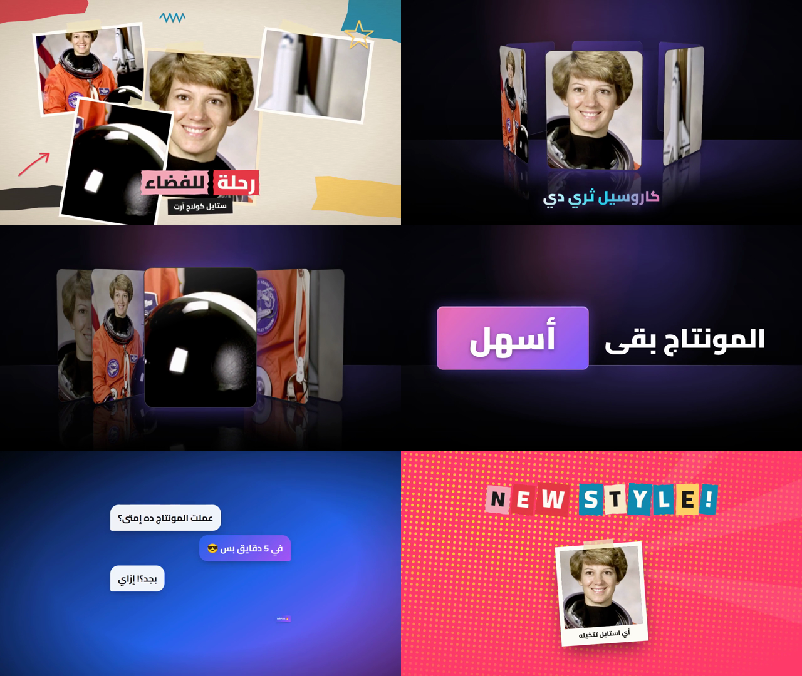

# EditFast — إضافة مونتاج ذكية لـ Adobe Premiere Pro

لوحة جوه بريمير فيها مونتير ذكي بتكلّمه، و26 أداة مونتاج. معظم الشغل **أوفلاين على جهازك** (القص، التفريغ، المالتي كام، التنظيم، الإيقاع، الحركة، المنحنيات، المكتبة)، والذكاء الاصطناعي كله بيعدّي من **OpenRouter بمفتاحك** وانت بتختار الموديل لكل ميزة.




## التثبيت

1. نزّل `EditFast-1.4.1.zip` وفكّه.
2. **ويندوز:** دبل كليك على `scripts/install-windows.bat`
   **ماك:** دبل كليك على `scripts/install-mac.command` (لو اترفض: كليك يمين > Open)
3. افتح بريمير ← `Window > Extensions > EditFast`

المثبّت بيعمل:
- ينسخ الإضافة لفولدر إضافات أدوبي.
- يفعّل `PlayerDebugMode` (لازم عشان الإضافة مش موقّعة من أدوبي).
- يثبّت **ffmpeg** و **whisper.cpp** و **yt-dlp** (ويندوز: winget + ريليس whisper.cpp — ماك: Homebrew).

محتاج **Premiere Pro 2021 (15.0) أو أحدث**.

## أول مرة (من تبويب ⚙️ الإعدادات)

| الحاجة | لازم؟ | ليه |
|---|---|---|
| مفتاح **OpenRouter** | للمونتير الذكي وكل مميزات الـ AI | [openrouter.ai/keys](https://openrouter.ai/keys) |
| موديل **Whisper** | للتفريغ | زرار "حمّل الموديل" (مرة واحدة — Large v3 Turbo الأدق للعربي) |
| مفتاح **ElevenLabs** | لتوليد المؤثرات الصوتية | [elevenlabs.io](https://elevenlabs.io/app/settings/api-keys) |
| مفاتيح **Pexels / Pixabay** | لمكتبة B-Roll وبحث النت | مجانية |
| مفتاح **Google Custom Search** + رقم المحرك (cx) | اختياري: نتايج Google جوه بحث النت | [مجاني 100 بحث/يوم](https://developers.google.com/custom-search/v1/introduction) |
| **yt-dlp** | للتحميل من يوتيوب/إنستجرام/تيك توك | المثبّت بيثبّته |
| **Node.js** + محرك Remotion | للمشاهد Pro | المثبّت بيثبّتهم (مرة واحدة ~200MB)، أو من تبويب مشاهد Pro |
| ملف **MOGRT أساسي** | عشان التايتلات تتعدّل من Essential Graphics | بيتلاقى لوحده من فولدر بريمير، أو اختاره |

**الموديلات:** في الإعدادات فيه لوحة "🤖 الموديلات لكل ميزة" — دوس "حمّل قائمة الموديلات من OpenRouter" واختار لكل ميزة الموديل اللي يشغّلها (أو موديل عام للكل). وكل تبويب فيه AI عنده نفس المختار فوق. المفاتيح والإعدادات بتتحفظ على جهازك بس في `~/.editfast`.

## الأدوات

| الأداة | بيشتغل | إزاي |
|---|---|---|
| ✨ **المونتير الذكي (EditFast AI)** | OpenRouter | تكتبله اللي عايزه. يسألك عن ذوقك (ألوان، خط، إيقاع، كابشن، مؤثرات) **مرة واحدة** ويحفظه، ويقرر كل فيديو محتاج إيه: يشيل التكرار والسكتات، يبدأ بهوك، يبني مشاهد متحركة بألوانك، كابشن ومؤثرات على الكلمة. مستويين: **قوي** و**قوي جدًا** (بيخطط ويراجع نفسه) — وكل مستوى بالموديل اللي تختاره. شغلته المونتاج والمشروع ده بس. |
| ✂️ **القص السريع** | أوفلاين | بيسمع الصوت (ffmpeg) ويلاقي كل سكتة ويشيلها ويقفّل الفراغ على كل التراكات. حساسية 1-10، هامش للكلام، و**انتقال صوتي** (Constant Power) عند كل قصة. بيشتغل على نسخة من السيكوينس. |
| 🎇 **المؤثرات التلقائية** | OpenRouter + ElevenLabs | الموديل بيقرا التفريغ ويفهم بيحصل إيه (مفاجأة، رقم، نكتة، انتقال) ويقترح صوت أو حركة لكل لحظة — تراجع وتشيل اللي مش عاجبك وتطبّق. |
| 🔊 **مؤثرات صوتية** | ElevenLabs | تكتب الوصف بالعربي، زرار يترجمه للإنجليزي، ويتولّد الصوت ويتحفظ على جهازك وتنزله عند رأس التشغيل. |
| 📝 **تفريغ الكلام** | أوفلاين (whisper.cpp) | توقيت **لكل كلمة** متظبط على الصوت نفسه (محاذاة DTW + Beam Search للكلام الأدق + الكلمة مابتبدأش جوه سكتة، وبيستخدم كل أنوية الجهاز). 7 لهجات (مصري، خليجي، شامي، عراقي، مغربي، فصحى، English). بعده تصحيح إملائي تلقائي (قواعد أوفلاين للهمزات والعبارات + الموديل لو فيه مفتاح، من غير ما التوقيت يبوظ). |
| 💬 **الكابشن** | أوفلاين | بينزل SRT على التايملين كـ caption track تعدّله من تبويب Text. عدد الكلمات، أقصى مدة، ووضع كلمة واحدة في الكارت. |
| 🎥 **المالتي كام** | أوفلاين | بيحلل صوت مايك كل كاميرا ويعرف مين بيتكلم، ويطلّع خطة تبديل (أقل مدة لقطة + لقطة واسعة اختيارية) **تراجعها وتعدّلها** قبل التطبيق. |
| 🗂️ **تنظيم المشروع** | أوفلاين | بيمسح المشروع ويوريك الخطة (فيديو، صوت/موسيقى، صوت/مؤثرات، صور، جرافيك، كابشن، سيكوينسات) قبل ما يلمس حاجة. |
| 〰️ **محرر المنحنيات** | أوفلاين | بيقرا الكي فريمز اللي على الكليب ويرسمها، تختار شكل الحركة (Expo، Back، Elastic، Bounce أو تسحب نقط البيزيير بإيدك) وهو يعيد كتابة الحركة كلها فريم بفريم. |
| 📚 **مكتبتك** | أوفلاين | ارمي الفولدر كله وهو يرتّب الساوند إفكتس (whoosh / impact / pop / riser…) والترانزيشنز والأوفرلايز والموسيقى لوحده. حط الماوس تسمع/تشوف، دبل كليك ينزل عند رأس التشغيل. |
| 🎬 **قوالب الحركة** | أوفلاين | **28 قالب** (12 دخول، 7 خروج، 9 تأكيد) بيكتبوا كي فريمز حقيقية على **Transform** تفتحها في Effect Controls وتعدّلها، و**3 مستويات قوة**. |
| 🔤 **تايتلات متحركة** | أوفلاين | **25 قالب**. ينزل عند رأس التشغيل كجرافيك تعدّل نصه من Essential Graphics، والحركة كي فريمز على الكليب. |
| 💧 **Liquid Glass** | أوفلاين (WebGL) | الستايل المشهور: زجاج سايل **بيكسر ويغبّش الفيديو اللي تحته فعلًا** — حواف لامعة، ألوان على الحواف، ظل، وحركة دخول سايلة. 10 ستايلات (كبسولة، كارت، عدسة مكبّرة، لوور ثيرد، إشعار، زرار اشترك، نص زجاج، شريط أيقونات، بانل جانبي، إطار) وكل حاجة فيهم بتتظبط (التغبيش، الانكسار، التكبير، اللون، اللمعة، الحركة). بيقرا فريمات الكليب اللي تحت رأس التشغيل وينزل طبقة ProRes 4444 شفافة فوقه بالظبط. والمونتير الذكي يقدر يعمله برضه. |
| ⚡ **مونتاج تلقائي بضغطة** | AI + أوفلاين | خطة تراجعها وتشيل منها اللي مش عايزه: تفريغ ← تكرار ← سكتات ← هوك يختاره الذكاء الاصطناعي ← تنضيف صوت ← زووم ← B-Roll على الكلام ← مؤثرات ← توطية موسيقى ← كابشن متحرك. كل خطوة بتبان حالتها، و**كل حاجة بتتسجل وترجع بزرار واحد**. |
| 🎞 **مشاهد Pro (Remotion)** | أوفلاين بعد التثبيت | محرك موشن جرافيك احترافي: **26 مكوّن** — عناوين حركية، تظليل، اقتباس، أرقام، رسوم، قوائم، خطوات، لوور ثيرد، لوجو، اشترك، بوست سوشيال، إيموجي، **كولاج صور، حروف مقصوصة، شخابيط يد، بولارويد، كاروسيل ثري دي، كارت ثري دي، مكعب كلمات، نص ثري دي، لقطة بزووم، إشعار موبايل، شريط بحث، محادثة، متصفح، أيقونة** — و9 خلفيات (منهم ورق، هالفتون، استوديو ثري دي). **المخرج الذكي** بيصمم المشهد من وصفك وبالاستايل اللي تختاره، وبيستخدم **لقطات من الفيديو بتاعك** في الكولاج والثري دي. |
| 🎨 **مونتاج بالاستايل** | AI + Remotion | **24 استايل**: كولاج آرت، ثري دي، نيون، مينيمال، سينمائي، بوب آرت، ليكويد جلاس، واجهات سوشيال، هرموزي، مستر بيست، ريترو VHS، أبيض وأسود، كاينتك تايبوجرافي، أنمي/مانجا، فيبرويف، مجلة، شرح/إنفوجرافيك، ريفيو تقني، فخم، فلوج/سفر، أخبار عاجلة، جيمنج، بلوبرينت، جرنج. كل استايل بخلفيته وألوانه وفلتر/طبقة لوك (VHS، جليتش، ضوء، شريط عاجل) وكابشن مناسب ليه. تقول «مونتجه بستايل هرموزي» أو تختار: المخرج بيقرا الكلام ويشوف اللقطات ويخطط كل المشاهد **في طلب واحد**، وRemotion يرندرها على جهازك وتنزل في أماكنها فوق الفيديو — وكلها ترجع بزرار تراجع واحد. |
| 🧩 **مكتبة القوالب** | Remotion | 35 قالب في 6 أقسام (نصوص متحركة، ليكويد جلاس، واجهات، مشاهد، ثري دي، كولاج) **بمعاينة متحركة** لما تعدّي بالماوس، مفضلة ⭐، تعدّل النص وتحطه على التايملين بضغطة. القوالب اللي فيها صور بتاخد لقطات من الفيديو حوالين رأس التشغيل. |
| 🎠 **كاروسيل ثري دي** | Remotion | من 2 لـ 10 صور/فيديوهات (أو لقطات من الفيديو): دايري / كوفر فلو / لولبي / كوتشينة، تتحكم في السرعة والاتجاه وميل الكاميرا والعمق والحجم والحواف والانعكاس والتوهج، **معاينة ثري دي حية** في اللوحة، وينزل **كلقطة واحدة** (أو شفاف فوق الفيديو). |
| ⭐ **أيقونات متحركة** | Remotion | 522 أيقونة: **إيموجي ملوّنة فلات** (زي إيموجي الموبايل) + خلفية **أيقونة آيفون** وحركات آيفون (فتحة، رعشة، طفو، إشعار بالرقم الأحمر)، و سوشيال ميديا (بألوان المنصات)، تفاعل، مونتاج وتصوير، عربيات، عقارات، أماكن وخرائط، بيزنس، تقنية، أكل، رياضة، علامات، أسهم، طقس، ناس — بحث بالعربي، و7 حركات جاهزة (رسم، بوب، نطّة، لف، نبض، هزّة، طلوع) مع خلفية دايرة/مربع/زجاج وكلمة تحتها. |
| 📋 **التعديلات** | AI (أو من غيره) | تلصق رسالة تعديلات العميل زي ما هي ← تتقسم لمهام واضحة بالأوقات (تدوس على الوقت يوديك له، أو ماركرز على التايملين) ← تعلّم ✓ على اللي خلص ← في الآخر **رسالة للعميل بالعامية المصرية** فيها اللي اتعمل واللي لسه، جاهزة للنسخ. كل جولة تعديلات بتتحفظ مع المشروع. |
| 🔊 **مؤثرات ترند + مزيكا AI** | أوفلاين + ElevenLabs | **30 مؤثر ترند بيتولّدوا على جهازك** (ووش، رايزر، داون ليفتر، إمباكت، ضربة سينمائية، 808، بوب، جليتش، شتر كاميرا، كيبورد، كاشير، سبركل…) مجانًا ومن غير حقوق، وبيتضافوا لمكتبتك؛ + **توليد مزيكا** بالذكاء الاصطناعي بالمدة اللي عايزها وتنزل على التايملين. |
| ⬇️ **تحميل من لينك** | yt-dlp | يوتيوب، إنستجرام، تيك توك، بنترست، X، فيسبوك: تحلل اللينك، تختار الجودة (من الجودات الموجودة فعلًا) و**الجزء اللي عايزه بشريط بتسحب بدايته ونهايته** على مدة الفيديو (أو تكتب الوقت، و«1.00» يعني دقيقة)، ولو القص أثناء التحميل مانفعش بينزّل الفيديو كله ويقصه على جهازك، وينزل H.264 جنب المشروع وعلى التايملين. |
| 🌐 **بحث النت** | Openverse / Wikimedia / Google / Pexels / Pixabay | صور وفيديو وصوت جوه الأداة، النتايج متنظّمة (حسب المصدر والشكل: أفقي/طولي/مربع) ومعاها الرخصة والمصدر، وتنزل على التايملين أو المشروع بضغطة. Pinterest: زرار يفتح البحث وتلصق لينك الـ Pin. |
| 📐 **المناطق الآمنة** | أوفلاين | تيك توك / ريلز / شورتس: معاينة على كادرك بزراير وكابشن المنصة، **فحص تلقائي** إن الوش (تتبّع وش أوفلاين) والكابشن بعيد عنهم، ماركرز على المشاكل، نقل الكابشن للمكان الآمن بضغطة، ودليل شفاف على التايملين. |
| 🔗 **EditFast Link** | أوفلاين | بيلاقي كل الملفات الناقصة (Media Offline) ويدوّر عليها في فولدر المشروع ومكانها القديم والهاردات الخارجية — حتى لو اتغيّر امتدادها أو اسمها اتغيّر شوية — ويربطها **واحد واحد** وانت شايف الحالة. |
| 👁 **عين المونتير** | AI | المونتير الذكي بقى **يشوف الفيديو نفسه**: بيطلب صور فريمات ويحكم عليها (أحسن تيك، لقطة مضلمة، مكان B-Roll)، وكشف تغيير اللقطات أوفلاين. |
| 📱 **ريلز وشورتس** | أوفلاين + AI | تحويل 9:16 / 4:5 / 1:1 **بتتبّع الوش** (الكاميرا بتتبع اللي بيتكلم بنعومة وبتسبقه، وبتقطع مع تغيير اللقطة)، والذكاء الاصطناعي يطلّع أقوى مقاطع شورتس من الفيديو الطويل ويعملها سيكوينسات جاهزة. |
| 💬 **كابشن متحرك** | أوفلاين | **13 ستايل** متزامنين مع كل كلمة (كاريوكي، بوب، بوكس، بولد ريلز، نيون، تدرج، بسيط، آلة كاتبة، هرموزي، بيست، هايلايتر، أوتلاين، ليريك) × **17 حركة دخول للكلمة** (نازلة من فوق، طالعة من تحت، من الجنب، زووم، بوب، نطّة، ضباب، قلبة، لفّة، مطّ، مرجيحة، حرف حرف، جليتش، موجة…) على **منحنى سرعة** تختاره (سريع في الأول وبطيء في الآخر، ناعم، مطاطي، نطّات) بقوته، ومدة دخول الكلمة والمسافة، والتوقيت: مع الكلام أو **ورا بعض بسرعتك انت** أو السطر مرة واحدة، + حركة خروج. أو **كابشن ثابت** من غير أي أنيميشن (بالشكل والألوان بس، وأسرع بكتير في الرندر). ومعاينة حية لكل حركة، وكابشن جاهز لكل استايل مونتاج. ترجمة لأي لغة كتراك جديد. |
| 🎚 **الصوت** | أوفلاين | تنضيف الصوت (بيقيس مستوى الدوشة في كل كليب ويشيلها ~30dB من غير ما يأثر على الكلام، دي-إيسر، كومبريسور، علو صوت موحد يوتيوب/بودكاست) + **توطية الموسيقى تلقائي تحت الكلام**. |
| 🖼 **صانع الثامبنيل** | أوفلاين + AI | بيلاقي أحلى فريمات (حدة + إضاءة + لقطات)، الذكاء الاصطناعي يقترح عناوين ويختار الفريم، 4 ستايلات يوتيوب، ويحفظ PNG جنب المشروع. |
| 🔎 **بحث وماركرز** | أوفلاين (+AI للفصول) | دوّر على أي كلمة اتقالت (بيتجاهل الهمزات والتشكيل) ويوديك مكانها، فصول يوتيوب جاهزة للنسخ أو كماركرز، وماركرز على إيقاع الموسيقى (BPM). |
| 🎞️ **B-Roll** | Pexels / Pixabay / فولدراتك | دوّر بالعربي أو الإنجليزي، حط الماوس تشوف، دوس تنزل على أول تراك فاضي — من غير متصفح ولا تحميل يدوي. |

## المشاهد بتنزل لايرز وتتعدّل

- كل مشهد (Pro، استايل، قالب) بينزل **سيكونس جوه السيكونس بتاعتك** اسمها `EF Scene ...`: دبل كليك تفتحها تلاقي **الخلفية لوحدها، وكل عنصر على تراك لوحده بتوقيته، واللوك (جرين/فينييت/VHS) فوق** — تمسح، تبدّل، تحرك، تغيّر التوقيت براحتك. (تقدر تقفل ده من تبويب مشاهد Pro لو عايز كليب واحد.)
- **عدّل المشهد:** اختاره على التايملين ← تبويب مشاهد Pro ← «عدّل المشهد المختار»: نصوصه وألوانه وتوقيته قدامك، تعدّل وتدوس «حدّث المشهد في مكانه» ويترندر تاني **في نفس المكان بالظبط**. أو اكتب التعديل («كبّر العنوان وخليه أحمر») والذكاء الاصطناعي يعدّله. والتراجع بيرجّع المشهد القديم.
- المونتير الذكي بيعمل كده برضه: «عدّل المشهد اللي عند رأس التشغيل وخلّي الخلفية سودا».

## التحديث التلقائي

الإضافة بتدوّر على نسخة جديدة أول ما تفتح وكل 6 ساعات. لو فيه، بيظهر شريط فوق فيه رقم النسخة والجديد فيها، وبتتحدّث لوحدها بعد 8 ثواني (أو بزرار «حدّث دلوقتي» لو قفلت التحديث التلقائي من الإعدادات)، وبعدها اللوحة بتعيد تشغيل نفسها. التحديث:
- بيتأكد إن الملف سليم (sha256) قبل ما يلمس حاجة، وبياخد **نسخة احتياطية** (وفيه زرار «رجّع النسخة اللي فاتت» في الإعدادات).
- مش بيلمس محرك Remotion المتثبّت ولا إعداداتك ولا مكتبتك؛ ولو التحديث غيّر نسخة Remotion بيثبّتها لوحده.
- لو التحديث غيّر ملف `CSXS/manifest.xml` نفسه محتاج تقفل بريمير وتفتحه.

**نشر نسخة جديدة (للمطوّر):** غيّر النسخة في `package.json` و`CSXS/manifest.xml` وبعدين:
```bash
node scripts/package.js --release "اللي اتغيّر في النسخة دي"
git add updates && git commit -m "Release x.y.z" && git push
```
ده بيحط `updates/latest.json` + الـ zip في الريبو، والإضافات المتثبّتة بتشوفه من `main` (أو من GitHub Releases لو رفعت الـ zip كـ Release). تقدر تغيّر مصدر التحديثات من الإعدادات.

## أمثلة للمونتير الذكي

- «مونتج الفيديو ده كله بذوقي»
- «ابني مشهد افتتاحي ٤ ثواني فيه اسم القناة وتحتها "حلقة جديدة كل خميس"»
- «شيل السكتات والتكرار وابدأ بأقوى جملة كهوك»
- «نزّل كابشن كلمة كلمة وحط مؤثرات صوت على اللحظات المهمة بس»
- «مونتجه بستايل كولاج آرت — ٤ مشاهد» · «اعمل كاروسيل ثري دي من أحلى اللقطات» · «حط أيقونة واتساب بتنط عند ثانية ١٠»
- «نزّل الجزء من ١:٢٠ لـ ٢:٠٠ من اللينك ده» · «افحص المناطق الآمنة لتيك توك» · «اربط الملفات الناقصة»

أي عملية بتشيل أجزاء بتتعمل على **نسخة** من السيكوينس، فالأصل بيفضل سليم.

**المونتير شايف السيكوينس:** مع كل رسالة بيوصله تلقائي صورة حية من السيكوينس (التراكات والكليبات، رأس التشغيل، المختار، الماركرز، المؤثرات اللي على كل كليب، والتفريغ — الأقرب لرأس التشغيل الأول). فتقدر تسأله «هو قال إيه عند دقيقة ٢؟» أو «فين الجزء اللي اتكلم فيه عن السعر؟» أو «إيه اللي تحت رأس التشغيل؟» ويرد على طول من غير ما يعدّل حاجة. الشريط اللي فوق الشات بيوريك هو شايف إيه دلوقتي.

**التوكنز والكاش:** Remotion بيرندر على جهازك ببلاش — الموديل بيكتب بس وصف قصير للمشهد (JSON ‏~500 توكن) بدل ما يكتب كود الأنيميشن كله (آلاف التوكنز). ومونتاج الاستايل بيخطط كل المشاهد في طلب واحد. وكمان **Prompt Caching**: تعليمات المونتير وقائمة الأدوات والمحادثة اللي فاتت بتتقري من الكاش (Claude بعلامات كاش، وGPT/Gemini/DeepSeek تلقائي) بحوالي **10% من السعر**؛ وعدّاد التوكنز في تبويب المونتير بيوريك الاستهلاك ونسبة الكاش والتكلفة.

**اختبار الموديلات:** في الإعدادات زرار «اختبر كل الموديلات» بيجرّب موديل كل ميزة على OpenRouter: بيرد ولا لأ، سرعته، وموديلات المونتير بيتأكد إنها بتعرف تستخدم الأدوات — ويقولك لو الموديل مش موجود في قائمة OpenRouter.

## الاختبارات

```bash
npm install
npm test          # 108 اختبار: الموديولات + سكريبت بريمير على محاكي Premiere + تكامل كامل
npm run test:ui   # 44 اختبار (اللوحة نفسها في Chromium)
npm run test:remotion  # رندر Remotion حقيقي (ProRes 4444 شفاف، H.264، كولاج وكاروسيل بصور وفيديو من الجهاز)
npm run package   # يطلّع dist/EditFast-<version>.zip
```

اللي بيتختبر: كشف السكتات الحقيقي بـ ffmpeg، الـ razor والـ ripple على كل التراكات، التفريغ end-to-end، الكابشن، التكرار وإعادة التيك، البحث، الفصول، كشف الـ BPM، المالتي كام على صوت حقيقي، الكي فريمز بوقت الميديا، المنحنيات، الـ 28 قالب × 3 مستويات، الـ 25 تايتل، المكتبة، التنظيم، OpenRouter / ElevenLabs / Pexels / Pixabay / Openverse / Wikimedia / Google (APIs متقلدة)، والوكيل الذكي بحلقة أدوات كاملة، الـ 30 مؤثر الترند (WAV حقيقي)، yt-dlp (بأداة بديلة بتطلع نفس المخرجات)، ربط الملفات الناقصة على محاكي بريمير، المناطق الآمنة، القوالب الـ 35، وكاش التوكنز.

## ملاحظات مهمة

- **اتختبرت على محاكي لبريمير مش بريمير نفسه.** القص والتقطيع وإضافة Transform والانتقال الصوتي بيستخدموا QE DOM (API داخلي في بريمير مش موثّق)؛ لو حاجة منهم اتصرفت غريب على نسختك ابعتلي اسم الأداة ورقم نسخة بريمير.
- **التايتلات قابلة للتعديل من Essential Graphics لما يكون فيه MOGRT أساسي.** لو مفيش، التايتل بينزل كفيديو شفاف (ProRes 4444) مش قابل لتعديل النص.
- **اختيار الموديل**: كل ميزة AI ليها موديل (13 ميزة) — من الإعدادات أو جنب الميزة، قائمة بتدوّر فيها بالاسم (بتتحمّل من OpenRouter لوحدها). «اختبر كل الموديلات» بيحط ✓/✗ جنب كل واحد.
- **الصرف**: جنب كل اختيار موديل فيه 💲 تقدير لتكلفة المرة الواحدة بالموديل ده (على فيديو ~10 دقايق) — بيتغيّر لما تغيّر الموديل. وفوق فيه عدّاد للي اتصرف النهارده (من OpenRouter نفسه لكل طلب): تدوس عليه تشوف الشهر، آخر 7 أيام، الصرف لكل موديل، وتحط حد يومي ينبهك لو عدّيته.
- **OpenRouter 402** = الرصيد أو حد المفتاح (Credit limit) مش كفاية: اشحن من openrouter.ai/settings/credits أو زوّد حد المفتاح من openrouter.ai/settings/keys. الإضافة بتعيد الطلب لوحدها بإجابة أقصر لو المفتاح يقدر.
- **ElevenLabs**: المفتاح بيبدأ بـ `sk_` وبيظهر مرة واحدة لما تعمله — الـ Key ID مش هيشتغل. من غير مفتاح، المؤثرات التلقائية بتستخدم المؤثرات الترند المتولّدة على جهازك.
- **Openverse وWikimedia** متاحين من غير مفتاح، بس كل نتيجة ليها رخصتها (CC) — اتأكد منها (مكتوبة على النتيجة).
- **Pinterest مالوش API بحث مفتوح**: البحث بيفتح في المتصفح وانت تلصق لينك الـ Pin (صورة أو فيديو).
- **ElevenLabs Music**: التوليد بيتحسب من رصيد حسابك.
- الهوك وإزالة التكرار بيشتغلوا أحسن على فيديو كلام بكاميرا واحدة على V1. اعمل الهوك قبل ما تحط طبقات فوقه.

## التصميم

واجهة داكنة فاخرة بأسلوب Liquid Glass (زجاج سايل بلمعة بتتبع الماوس) وحركات للنصوص (العناوين والردود بتظهر كلمة كلمة، عدّادات، لمعة على العناوين): خلفية متحركة بتدرجات (Aurora)، كروت زجاجية بحواف متدرجة، أزرار بجلو وتدرج ولمعة، أيقونات خطية، وأنيميشن لكل حاجة (دخول التبويبات، فقاعات الشات، مؤشر الكتابة، الشريط). الخط Cairo متضمّن جوه الإضافة (رخصة OFL) فبيشتغل أوفلاين، والحركة بتقف لوحدها لو الجهاز مفعّل "تقليل الحركة".

## رخص المكوّنات

- **Remotion**: مجاني للاستخدام الشخصي والأفراد والشركات لحد 3 أشخاص؛ الشركات الأكبر محتاجة [رخصة Remotion](https://www.remotion.dev/license).
- **face-api** (تتبّع الوش): MIT. خط **Cairo**: SIL OFL. أيقونات **Lucide**: ISC. إيموجي **Fluent** (Microsoft): MIT. شعارات **Simple Icons**: CC0 (الشعارات نفسها علامات تجارية لأصحابها). الكل متضمّن.
- **yt-dlp** (Unlicense) بيتثبّت لوحده على الجهاز، مش جوه الإضافة. نزّل بس المحتوى اللي عندك حق تستخدمه.
- المؤثرات الصوتية الترند متولّدة بالكود، فمالهاش حقوق.

## هيكل المشروع

```
CSXS/manifest.xml   تعريف الإضافة لبريمير (CEP)
client/             اللوحة (HTML/CSS/JS) — تبويب لكل أداة في client/js/tabs
core/               المنطق (Node.js): القص، التفريغ، الكابشن، المالتي كام، OpenRouter، الوكيل…
host/host.jsx       سكريبت بريمير (ExtendScript ES3)
remotion/           محرك المشاهد Pro (مكوّنات React + render.mjs)
scripts/            مثبّتات ويندوز وماك + سكريبت التغليف
tests/              اختبارات الوحدات، محاكي بريمير، والتكامل، وواجهة اللوحة
```
